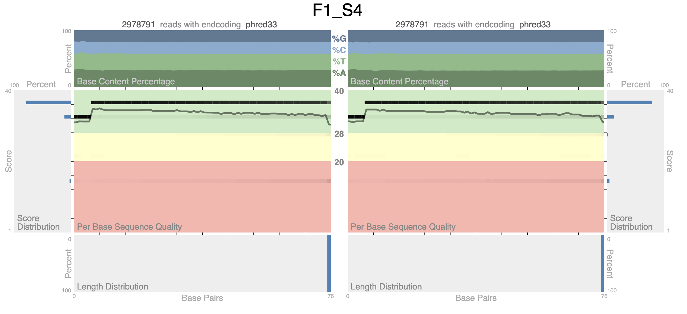
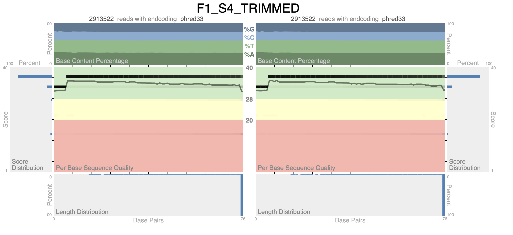
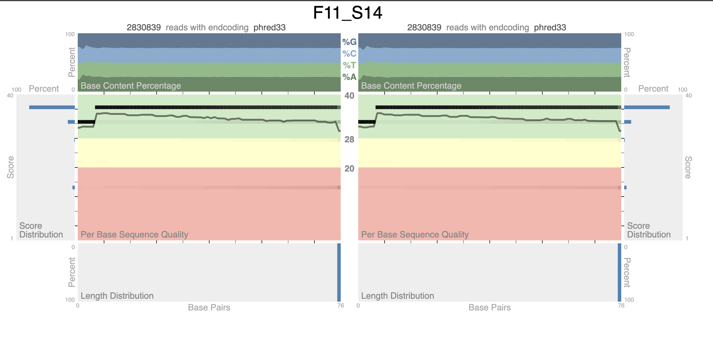
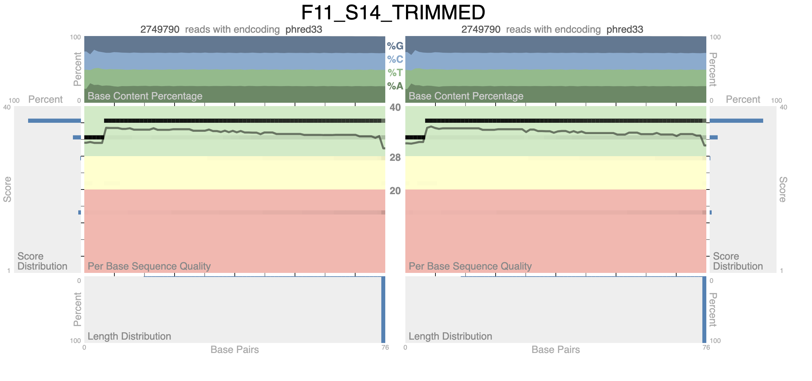

# Detecting Pathogen DNA in Sequencing Data

A bioinformatics pipeline for detecting pathogen DNA in paired-end sequencing data from a mouse facility at a research hospital. Reads are aligned against a host (mouse) genome to filter host-derived sequences, then unmapped reads are aligned against a combined pathogen reference index to identify and quantify microbial contamination.

**Supports detection of:**
- *Helicobacter hepaticus*
- *Staphylococcus aureus*
- *Enterococcus faecalis*
- *Rodentibacter pneumotropicus*
- *Klebsiella oxytoca*
- *Rodentibacter heylii*

---

## Background

### FASTA Files

FASTA (.fna) files store reference genome sequences. Lines starting with `>` indicate the beginning of a sequence record (including a unique identifier). The actual nucleotide sequence follows on subsequent lines.

```
>NC_004917.1 Helicobacter hepaticus ATCC 51449, complete sequence
CATTAAACCAAGTATAAAATCTATAAATTATCTTTA...
```

### FASTQ Files

FASTQ files contain sequence data and quality information as produced by sequencing machines. Each entry consists of four lines:

- **Sequence Identifier Line:** Starts with `@` followed by a unique identifier for the read (may include instrument, sample, and length information).
- **Sequence Line:** Contains the actual nucleotide sequence of the DNA/RNA read.
- **Quality Score Identifier Line:** Starts with `+` and usually mirrors the sequence identifier.
- **Quality Score Line:** Contains ASCII-encoded quality scores representing the confidence of each base call.

```
@SRX3198644.1 1 length=45
TTGTTGAACTGGCTCTTTTTCGCAATCCCGCTGTAAGTACTGTCT
+SRX3198644.1 1 length=45
AAAAAEEEEEEEEEEEEEEEEEEEAEEAEEEEEEEEEEEEEEEEE
```

---

## Pipeline Overview

```
┌─────────────────────┐
│  Paired-end FASTQ   │
│  (R1 + R2)          │
└────────┬────────────┘
         │
         ▼
┌─────────────────────┐
│  Quality Control    │
│  (fastp / quack)    │
└────────┬────────────┘
         │
         ▼
┌─────────────────────┐
│  Align to Mouse     │     ┌──────────────────┐
│  Genome (bwa mem)   │────▶│  Mouse-mapped    │
└────────┬────────────┘     │  reads (discard) │
         │                  └──────────────────┘
         │ unmapped
         ▼
┌─────────────────────┐
│  Align to Pathogen  │     ┌──────────────────┐
│  Index (bwa mem)    │────▶│  Unmapped reads  │
└────────┬────────────┘     │  (unidentified)  │
         │                  └──────────────────┘
         │ mapped
         ▼
┌─────────────────────┐
│  Sort, Index, Stats │
│  (samtools)         │
└────────┬────────────┘
         │
         ▼
┌─────────────────────┐
│  Summary Report     │
│  (per pathogen)     │
└─────────────────────┘
```

---

## Getting Started

### 1. System Requirements

| Component | Specification |
|:----------|:--------------|
| OS | Ubuntu 22.04.01 |
| Virtualization | VirtualBox 6.5.0 |
| Architecture | x86_64 GNU/Linux |
| Disk Space | 100 GB |
| RAM | 5.3 GB |

### 2. Download Reference Genomes

Download pathogen genomes using the `ncbi-datasets` tool:

```bash
datasets download genome accession \
  GCF_000007905.1,GCF_000393015.1,GCF_003812925.1,\
  GCF_000013425.1,GCF_000730685.1,GCF_010587025.1 \
  --include genome
```

Combine pathogen FASTA files into a single reference:

```bash
cat GCF_000007905.1_ASM790v1_genomic.fna \
    GCF_000393015.1_EntefaecT5V1_genomic.fna \
    GCF_003812925.1_ASM381292v1_genomic.fna \
    GCF_000013425.1_ASM1342v1_genomic.fna \
    GCF_000730685.1_ASM73068v1_genomic.fna \
    GCF_010587025.1_ASM1058702v1_genomic.fna \
    > combined_pathogen_genomes.fna
```

### 3. Build BWA Indices

```bash
bwa index -p pathogen_combined_index combined_pathogen_genomes.fna
bwa index -p mouse_index GCF_000001635.27_GRCm39_genomic.fna  # ~18 hours
```

### 4. Directory Structure

```
microbiome_analysis/
├── run.sh
├── utils/
│   ├── quack/
│   ├── quack_qc.sh
│   └── pathogen_mapping.sh
├── 0_ref_genome/
│   ├── mouse_genome.fna
│   ├── pathogen_1_genome.fna
│   ├── ...
│   └── pathogen_combined_genome.fna
├── 1_index/
│   ├── mouse_index.*
│   └── pathogen_combined_index.*
├── 2_exp_fastq/
│   ├── F1_S4_R1.fastq.gz
│   ├── F1_S4_R2.fastq.gz
│   └── ...
├── 3_alignment/
└── 4_stats/
```

### 5. Run the Pipeline

```bash
bash run.sh
```

---

## Trimming / Filtering

Quality trimming is performed with `fastp`:

```bash
fastp -i F1_S4_R1.fastq.gz -I F1_S4_R2.fastq.gz \
      -o F1_S4_TRIMMED_R1.fastq.gz -O F1_S4_TRIMMED_R2.fastq.gz \
      -h F1_S4_fastp_report.html
```

Both samples (F1_S4 and F11_S14) had very low adapter content (~0.08–0.14%), indicating data was likely pre-trimmed upstream.

**F1_S4 filtering summary:**

| Metric | Before | After |
|:-------|:-------|:------|
| Total reads (per direction) | 2,978,791 | 2,913,522 |
| Total bases (per direction) | ~226M | ~221M |
| Q20 bases | >95% | improved |
| Q30 bases | >92% | improved |
| Reads passed filter | — | 5,827,044 |
| Adapter-trimmed reads | — | 18,330 |
| Bases trimmed | — | 346,344 |
| Duplication rate | — | ~42.75% |

---

## Pipeline Scripts

### run.sh

The main script iterates over FASTQ files and performs:
1. **FASTQ QC** via [quack](https://github.com/IGBB/quack)<sup><a href="#footnote1">[1]</a></sup>
2. **Alignment to mouse genome** — filters host reads
3. **Alignment to pathogen index** — identifies microbial reads from unmapped fraction
4. **Sorting and indexing** — prepares BAM for statistics
5. **Reporting** — calculates per-pathogen read counts and percentages

```bash
#!/bin/bash

exp="P11_S25"

R1="${exp}_R1"
R2="${exp}_R2"

mouse_index="1_index/mouse_index"
pathogen_index="1_index/pathogen_combined_index"
input_folder="2_exp_fastq"
output_folder="3_alignment/$exp"
stats_folder="4_stats/$exp"
input_reads1="$input_folder/${R1}.fastq.gz"
input_reads2="$input_folder/${R2}.fastq.gz"

mkdir -p "$output_folder"
mkdir -p "$stats_folder"

# Check if mapping file exists. If not, create mapping file
if [ ! -f "4_stats/pathogen_mapping.txt" ]; then
    bash "utils/pathogen_mapping.sh"
fi

# Execute quack FASTQ QC
bash utils/quack_qc.sh ${exp}

# Align against the mouse genome
bwa mem -t 4 "$mouse_index" "$input_reads1" "$input_reads2" \
  | samtools view -b -f 2 -F 2304 -U "$output_folder/${exp}_mouse_unmapped.bam" - \
  > "$output_folder/${exp}_mouse_mapped.bam"

# Align unmapped-to-mouse reads against pathogens
samtools fastq -@ 4 -1 R1.fastq -2 R2.fastq "$output_folder/${exp}_mouse_unmapped.bam"

bwa mem -t 4 "$pathogen_index" R1.fastq R2.fastq \
  | samtools view -b -f 2 -F 2304 -U "$output_folder/${exp}_pathogen_unmapped.bam" - \
  > "$output_folder/${exp}_pathogen_mapped.bam"

rm R1.fastq R2.fastq

# Sorting mapped pathogen reads and indexing
samtools sort -o "$output_folder/${exp}_pathogen_mapped_sorted.bam" \
  "$output_folder/${exp}_pathogen_mapped.bam"
samtools index "$output_folder/${exp}_pathogen_mapped_sorted.bam"

# Generating index statistics
samtools idxstats "$output_folder/${exp}_pathogen_mapped_sorted.bam" \
  > "$stats_folder/${exp}_idxstats.txt"

# Calculate read statistics
reads_mouse_mapped=$(samtools view -c "$output_folder/${exp}_mouse_mapped.bam")
reads_mouse_unmapped=$(samtools view -c -F 2304 "$output_folder/${exp}_mouse_unmapped.bam")
reads_total=$(( $reads_mouse_mapped + $reads_mouse_unmapped ))

reads_pathogen_mapped=$(samtools view -c "$output_folder/${exp}_pathogen_mapped.bam")
reads_pathogen_unmapped=$(samtools view -c -F 2304 "$output_folder/${exp}_pathogen_unmapped.bam")
reads_total_mapped=$((reads_mouse_mapped + reads_pathogen_mapped))

percentage_mouse_mapped=$(awk "BEGIN {printf \"%.2f\", ($reads_mouse_mapped/$reads_total)*100}")
percentage_mouse_unmapped=$(awk "BEGIN {printf \"%.2f\", ($reads_mouse_unmapped/$reads_total)*100}")
percentage_pathogen_mapped=$(awk "BEGIN {printf \"%.2f\", ($reads_pathogen_mapped/$reads_total)*100}")
percentage_pathogen_unmapped=$(awk "BEGIN {printf \"%.2f\", ($reads_pathogen_unmapped/$reads_total)*100}")
percentage_total_mapped=$(awk "BEGIN {printf \"%.2f\", (($reads_total_mapped/$reads_total)*100)}")

# Translate reference genome identifiers to pathogen names
declare -A mapping
while IFS= read line; do
    identifier=$(echo "$line" | awk '{print $1}')
    name=$(echo "$line" | awk '{$1=""; print $0}' | xargs)
    mapping["$identifier"]="$name"
done < "4_stats/pathogen_mapping.txt"

declare -A pathogen_reads
while IFS=$'\t' read -r identifier length mapped_reads unmapped_reads; do
    translated="${mapping[$identifier]}"
    if [ -n "$translated" ]; then
        (( pathogen_reads["$translated"] += mapped_reads ))
    else
        pathogen_reads["$identifier"]="$mapped_reads"
    fi
done < "$stats_folder/${exp}_idxstats.txt"

# Write summary report
pathogen_sorted=("Enterococcus_faecalis" "Helicobacter_hepaticus" "Klebsiella_oxytoca" \
  "Rodentibacter_heylii" "Rodentibacter_pneumotropicus" "Staphylococcus_aureus" "*")

echo -e "Total reads for ${exp}: $reads_total (100%)\n-----" > "$stats_folder/${exp}_summary.txt"
echo -e "Mouse:\t\t\tMapped: $reads_mouse_mapped ($percentage_mouse_mapped%)\t| Unmapped: $reads_mouse_unmapped ($percentage_mouse_unmapped%)" >> "$stats_folder/${exp}_summary.txt"
echo -e "Pathogen in non-mouse:\tMapped: $reads_pathogen_mapped ($percentage_pathogen_mapped%)\t| Unmapped: $reads_pathogen_unmapped ($percentage_pathogen_unmapped%)" >> "$stats_folder/${exp}_summary.txt"
echo -e "Total:\t\t\tMapped: $reads_total_mapped ($percentage_total_mapped%)\t| Unmapped: $reads_pathogen_unmapped ($percentage_pathogen_unmapped%)" >> "$stats_folder/${exp}_summary.txt"

for pathogen in "${pathogen_sorted[@]}"; do
    percentage_mapped=$(awk "BEGIN {printf \"%.2f\", (${pathogen_reads[$pathogen]}/$reads_pathogen_mapped)*100}")
    percentage_unmapped=$(awk "BEGIN {printf \"%.2f\", (${pathogen_reads[$pathogen]}/$reads_mouse_unmapped)*100}")
    echo -e "$pathogen\t\t${pathogen_reads[$pathogen]}\t(${percentage_mapped}%\t| ${percentage_unmapped}%)" >> "$stats_folder/${exp}_summary.txt"
done
```

### quack_qc.sh

```bash
#!/bin/bash

SAMPLE_NAME="$1"

INPUT_DIR="2_exp_fastq"
OUTPUT_DIR="4_stats"
OUTPUT_SAMPLE_DIR="$OUTPUT_DIR/$SAMPLE_NAME/"

export PATH="utils/quack/:$PATH"

mkdir -p "$OUTPUT_SAMPLE_DIR"

quack -1 "$INPUT_DIR/${SAMPLE_NAME}_R1.fastq.gz" \
      -2 "$INPUT_DIR/${SAMPLE_NAME}_R2.fastq.gz" \
      -n $SAMPLE_NAME > $OUTPUT_SAMPLE_DIR/${SAMPLE_NAME}_quack_QC.svg
```

### pathogen_mapping.sh

Since the combined pathogen FASTA contains multiple contigs per organism (18 reference sequences for 6 pathogens), this script maps each sequence identifier to its pathogen name:

```bash
#!/bin/bash

input_file="0_ref_genome/combined_pathogen_genome.fna"
output_file="4_stats/pathogen_mapping.txt"

mkdir -p "4_stats"

declare -A reference_to_pathogen

while IFS= read -r line; do
    identifier=$(echo "$line" | awk -F' ' '{print $1}')
    pathogen=$(echo "$line" | awk -F' ' '{print $2 "_" $3}')
    reference_to_pathogen["$identifier"]="$pathogen"
done < <(grep ">" "$input_file")

echo "Reference Genome Identifier	Pathogen Name" > "$output_file"
for key in "${!reference_to_pathogen[@]}"; do
    cleaned_key="${key#>}"
    printf "%-30s %s\n" "$cleaned_key" "${reference_to_pathogen[$key]}" >> "$output_file"
done
```

---

## Tools

**BWA (Burrows-Wheeler Aligner)**<sup><a href="#footnote2">[2]</a></sup>

BWA aligns short DNA sequences against a large reference genome using the Burrows-Wheeler Transform algorithm. The `bwa mem` command is used here for paired-end read alignment. Results are output in SAM/BAM format.

**Samtools**<sup><a href="#footnote3">[3]</a></sup>

Samtools is a suite of programs for manipulating high-throughput sequencing data in SAM/BAM format. Used in this pipeline for:
- Filtering mapped/unmapped reads by flag
- Converting between SAM and BAM formats
- Sorting and indexing BAM files
- Generating alignment statistics (`idxstats`)

---

## Results

### F1_S4

**Read alignment summary (no trimming):**

| Category | Mapped | % | Unmapped | % |
|:---------|-------:|:--|:---------|:--|
| Mouse | 152,609 | 2.56% | 5,804,973 | 97.44% |
| Pathogen (non-mouse) | 4,739,137 | 79.55% | 1,065,836 | 17.89% |
| **Total** | **4,891,746** | **82.11%** | **1,065,836** | **17.89%** |

**Per-pathogen breakdown (no trimming):**

| Pathogen | Mapped reads | % of pathogen | % of non-mouse |
|:---------|-------------:|:--------------|:---------------|
| *R. pneumotropicus* | 4,681,031 | 98.77% | 80.64% |
| *R. heylii* | 54,258 | 1.14% | 0.93% |
| *K. oxytoca* | 2,355 | 0.05% | 0.04% |
| *E. faecalis* | 811 | 0.02% | 0.01% |
| *S. aureus* | 648 | 0.01% | 0.01% |
| *H. hepaticus* | 81 | 0.00% | 0.00% |

**Read alignment summary (trimmed):**

| Category | Mapped | % | Unmapped | % |
|:---------|-------:|:--|:---------|:--|
| Mouse | 131,518 | 2.26% | 5,695,526 | 97.74% |
| Pathogen (non-mouse) | 4,685,620 | 80.41% | 1,009,906 | 17.33% |
| **Total** | **4,817,138** | **82.67%** | **1,009,906** | **17.33%** |

**Per-pathogen breakdown (trimmed):**

| Pathogen | Mapped reads | % of pathogen | % of non-mouse |
|:---------|-------------:|:--------------|:---------------|
| *R. pneumotropicus* | 4,628,239 | 98.78% | 81.26% |
| *R. heylii* | 53,616 | 1.14% | 0.94% |
| *K. oxytoca* | 2,294 | 0.05% | 0.04% |
| *E. faecalis* | 810 | 0.02% | 0.01% |
| *S. aureus* | 627 | 0.01% | 0.01% |
| *H. hepaticus* | 81 | 0.00% | 0.00% |

<p align="center">

<br><span>Quack QC report for F1_S4 (no trimming).</span>
</p>

<p align="center">

<br><span>Quack QC report for F1_S4 (trimmed).</span>
</p>

---

### F11_S14

**Read alignment summary (no trimming):**

| Category | Mapped | % | Unmapped | % |
|:---------|-------:|:--|:---------|:--|
| Mouse | 385,450 | 6.81% | 5,276,228 | 93.19% |
| Pathogen (non-mouse) | 19,516 | 0.34% | 5,256,712 | 92.85% |
| **Total** | **404,966** | **7.15%** | **5,256,712** | **92.85%** |

**Per-pathogen breakdown (no trimming):**

| Pathogen | Mapped reads | % of pathogen | % of non-mouse |
|:---------|-------------:|:--------------|:---------------|
| *S. aureus* | 9,259 | 47.44% | 0.18% |
| *K. oxytoca* | 4,473 | 22.92% | 0.08% |
| *E. faecalis* | 3,134 | 16.06% | 0.06% |
| *R. heylii* | 1,109 | 5.68% | 0.02% |
| *R. pneumotropicus* | 1,001 | 5.13% | 0.02% |
| *H. hepaticus* | 542 | 2.78% | 0.01% |

**Read alignment summary (trimmed):**

| Category | Mapped | % | Unmapped | % |
|:---------|-------:|:--|:---------|:--|
| Mouse | 364,859 | 6.63% | 5,134,721 | 93.37% |
| Pathogen (non-mouse) | 19,283 | 0.35% | 5,115,438 | 93.02% |
| **Total** | **384,142** | **6.98%** | **5,115,438** | **93.02%** |

**Per-pathogen breakdown (trimmed):**

| Pathogen | Mapped reads | % of pathogen | % of non-mouse |
|:---------|-------------:|:--------------|:---------------|
| *S. aureus* | 9,165 | 47.53% | 0.18% |
| *K. oxytoca* | 4,402 | 22.83% | 0.09% |
| *E. faecalis* | 3,077 | 15.96% | 0.06% |
| *R. heylii* | 1,077 | 5.59% | 0.02% |
| *R. pneumotropicus* | 1,023 | 5.31% | 0.02% |
| *H. hepaticus* | 540 | 2.80% | 0.01% |

<p align="center">

<br><span>Quack QC report for F11_S14 (no trimming).</span>
</p>

<p align="center">

<br><span>Quack QC report for F11_S14 (trimmed).</span>
</p>

---

## Notes

- Depending on experimental setup, skipping alignment against the mouse genome could significantly reduce processing time (~80 min with ~1.1M reads). The exclusion of this step does not result in a substantial increase in host-derived reads, accounting for only about 1% of total reads.
- Paired-end FASTQ files are provided by the client.
- Show number of read-pairs: `samtools view -f 2 "$output_folder/${exp}_pathogen_mapped.bam" | awk '{print $1}' | sort -u | wc -l`

---

## References

<a name="footnote1">[1]</a> IGBB. *Quack — FASTQ Quality Control*. <a href="https://github.com/IGBB/quack" target="_blank">https://github.com/IGBB/quack</a><br>
<a name="footnote2">[2]</a> Li, H. & Durbin, R. (2009). *Fast and accurate short read alignment with Burrows-Wheeler transform*. Bioinformatics, 25(14), 1754–1760.<br>
<a name="footnote3">[3]</a> Li, H. et al. (2009). *The Sequence Alignment/Map format and SAMtools*. Bioinformatics, 25(16), 2078–2079.<br>
<a name="footnote4">[4]</a> NCBI Datasets. <a href="https://www.ncbi.nlm.nih.gov/datasets/" target="_blank">https://www.ncbi.nlm.nih.gov/datasets/</a><br>
<a name="footnote5">[5]</a> Chen, S. et al. (2018). *fastp: an ultra-fast all-in-one FASTQ preprocessor*. Bioinformatics, 34(17), i884–i890.

| Pathogen | Accession | Source |
|:---------|:----------|:-------|
| *Helicobacter hepaticus* | GCF_000007905.1 | NCBI<sup><a href="#footnote4">[4]</a></sup> |
| *Staphylococcus aureus* | GCF_000013425.1 | NCBI<sup><a href="#footnote4">[4]</a></sup> |
| *Enterococcus faecalis* | GCF_000393015.1 | NCBI<sup><a href="#footnote4">[4]</a></sup> |
| *Rodentibacter pneumotropicus* | GCF_000730685.1 | NCBI<sup><a href="#footnote4">[4]</a></sup> |
| *Klebsiella oxytoca* | GCF_003812925.1 | NCBI<sup><a href="#footnote4">[4]</a></sup> |
| *Rodentibacter heylii* | GCF_010587025.1 | NCBI<sup><a href="#footnote4">[4]</a></sup> |
| Host (*Mus musculus* C57BL/6J) | GCF_000001635.27 | NCBI<sup><a href="#footnote4">[4]</a></sup> |
